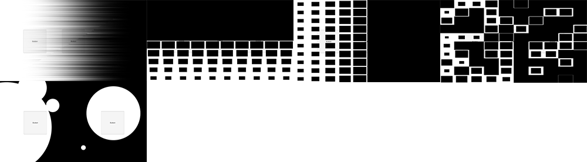

# ShaderTransitionEffects
<b>The collection of the basic shader-based transition effects</b> 
It is the code-based shader to implement the transition effect. 
I might update this project when another idea comes up to me. 
 

